## Scrach3とスマートフォンをつなげて遊ぶ
MyriadApiを使って、スマートフォンとScratch3をつなげて遊んでみましょう。  

### 準備
- Scrach3   
公式のScrach3β版はカスタム拡張機能を利用出来ません。なので、こちらに拡張機能を追加できるバージョンを準備しましたので、こちらをお使いください。  
   [http://aknow2.com/scratch/](http://aknow2.com/scratch/)
- 拡張ブロック  
今回使用するScrach3の拡張ブロックです。下記のURLをメモしてください。
  https://myriadapi.github.io/myriad_scratch3_blocks/js/blocks.js
- Myriad Api  
  スマートフォンとScratchを接続するために必要なアプリです。  
  PlayStoreよりダウンロードしてください。  
  

### やってみよう
ここでは「光センサーの値を読み取り、スクラッチキャットにしゃべらせる」という事をやります。 

1. 拡張機能に対応したScratch3を↓のURLから開いてください  
   [http://aknow2.com/scratch/](http://aknow2.com/scratch/)
   ※アプリがHttpsにまだ対応していないので、httpのバージョンになっています。
1. Scratchの左下にある拡張追加をクリックしてください。  
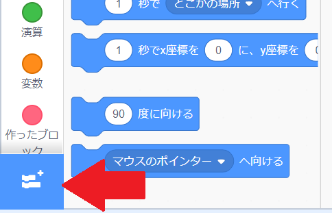
1. 拡張機能のChoose Extensionを選択してください。
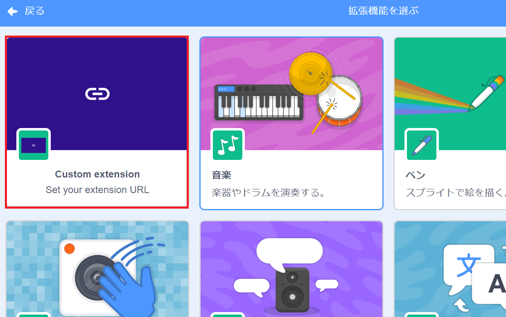
1. URLの入力ダイアログが表示されるので、下記のURLをコピーして入力してください
  [https://myriadapi.github.io/myriad_scratch3_blocks/js/blocks.js](https://myriadapi.github.io/myriad_scratch3_blocks/js/blocks.js)
1.  「作ったブロック」下にMyriad Scratch3 blocksと表示されればOKです。  
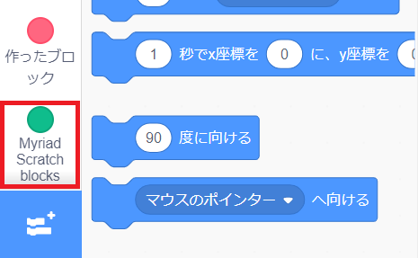
1. お決まりのイベントにある「緑旗が押されたとき」のブロックを追加してください   
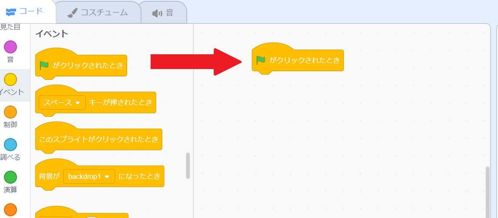

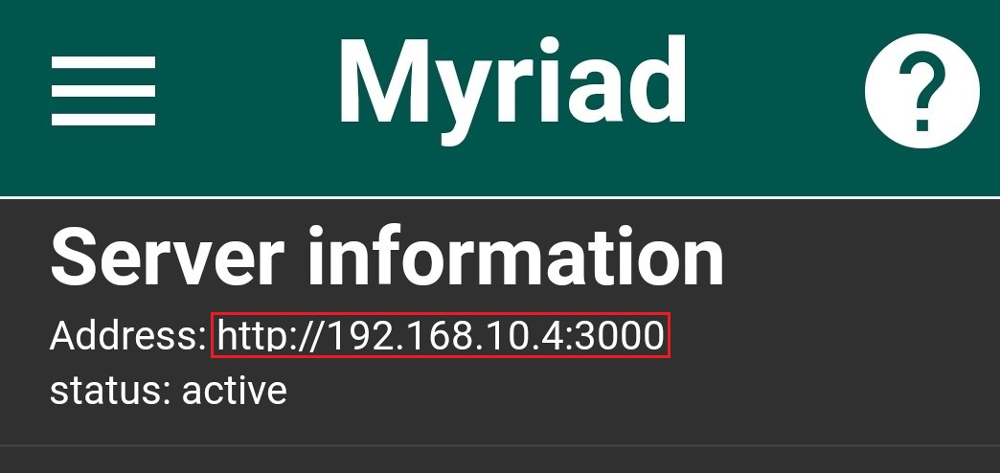
1. 再びScratch3の画面に戻り、「作ったブロック」下にある「Myriad Scratch3 blocks」を選択してください。  
1. 一番上にある、「set API URL」を追加してください。  
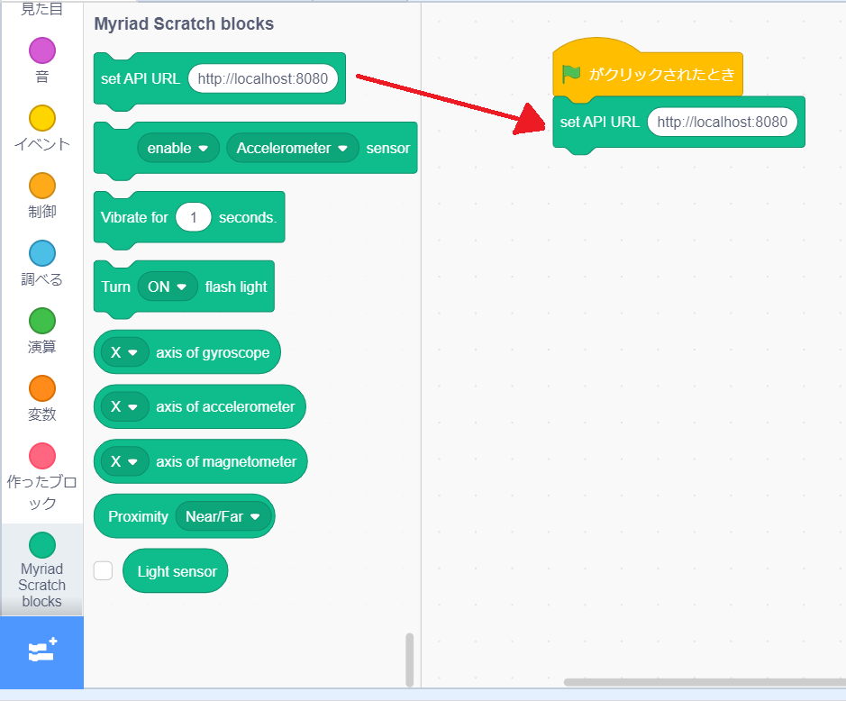
1. ここで、準備の時にダウンロードしたアプリを起動してください。起動出来たらアプリ上部に表示されているAddressの「http://〇〇〇 」の部分をメモしてください。  
1. 「set API URL」のテキストボックスに７でメモしたアプリに表示されている「http://○○○」を入力してください。URLを入力することでスマートフォンとScratchの接続が行われます。
1. 次に明るさをはかるためのライトセンサーを有効してみましょう。↓のブロックを追加してください。 
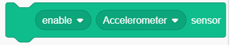
1. 追加したブロックの選択メニューから「Light」を選択してください。 
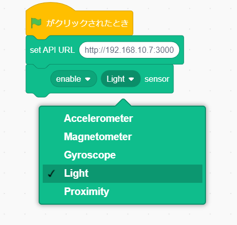
1. ここで一度実行してみましょう。スクラッチキャットの上に緑の旗があるのでクリックしてください。 
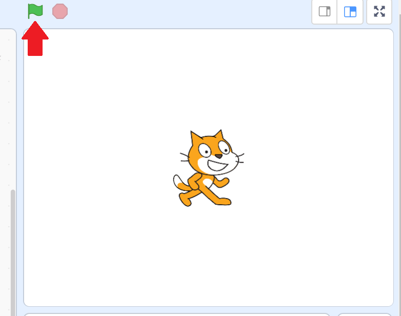
1. スマートフォンのアプリ上にあるLight Sensorが有効になるはずです。  
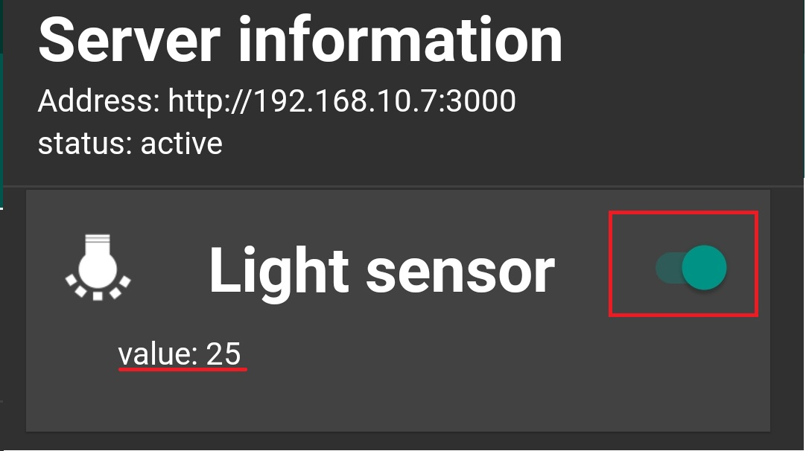
1. それでは、スクラッチキャットに光センサーの値をしゃべらしてみましょう。制御から「ずっと」と「１秒待つ」のブロックを追加してください。「1秒待つ」のブロックは「ずっと」の中に入れてください。
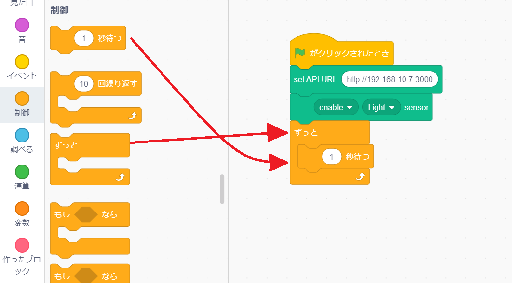
1. 「見た目」から「こんにちは！と言う」のブロックを「1秒待つ」のブロックの後に追加します。
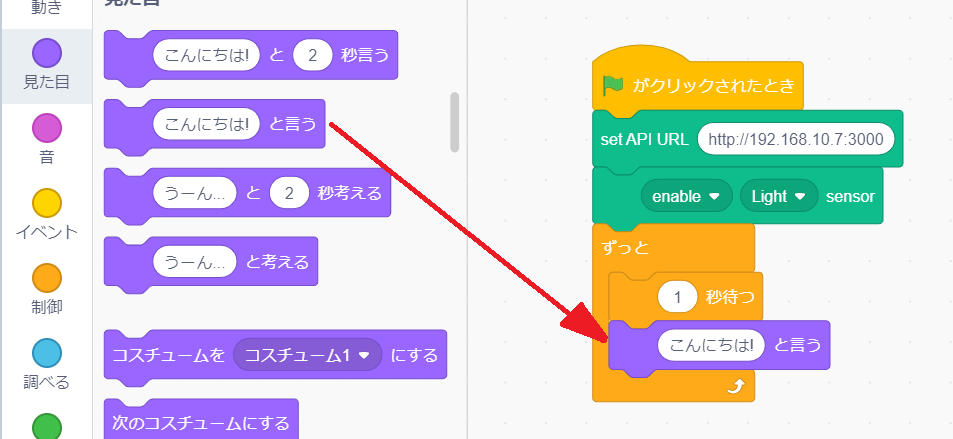
1. Myriad Scratch blocksから「Light Sensor」ブロックを「こんにちは！」の部分に入れてください。
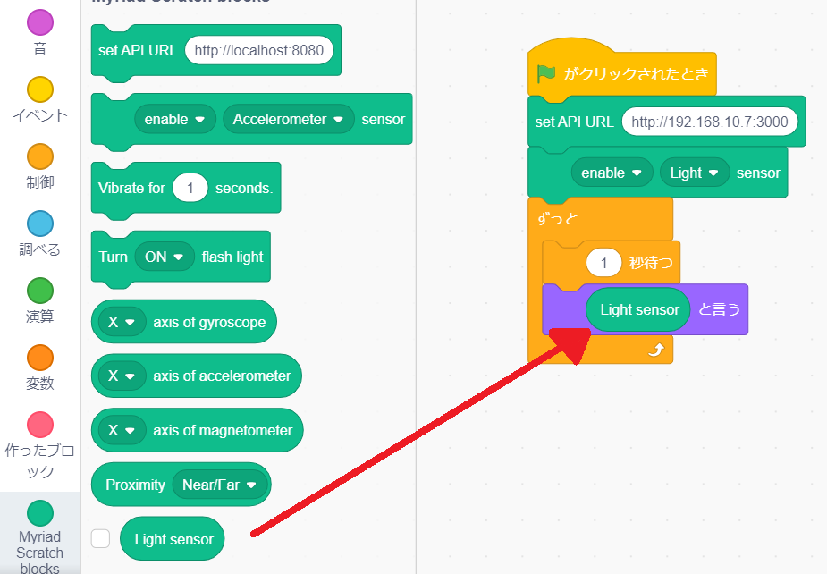
1. 実行してみましょう。緑の旗を押してください。ネコが1秒ごとにセンサーの値を読み上げてくれます。スマートフォンの上に手をかざしたり、部屋の照明をつけたり消したりするとネコがしゃべる値が変わると思います。
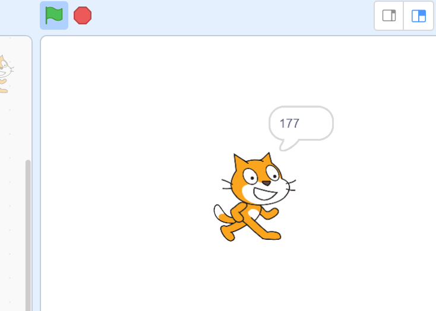
1. これでチュートリアルは完了です。Myriad Scratch Blocksには他にもフラッシュライトを点灯させたり、様々なセンサーの値を読み取る事が出来るので遊んでみてください。
    
    
### リンク  
- このスクラッチブロックのソースコードは[ここ](https://github.com/MyriadApi/myriad_scratch3_blocks)に公開しています。  

- [API リファレンス](https://myriadapi.github.io/ja/)